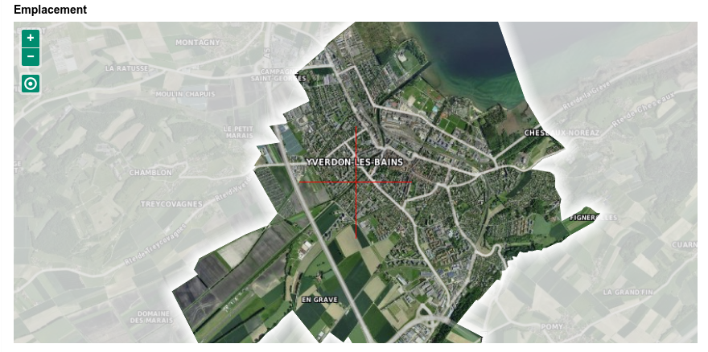
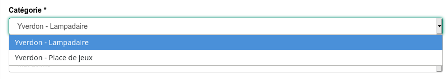
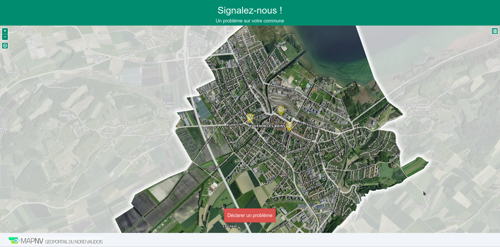
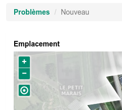

# Features

## Open source Licence

GetItFixed! is Open Source, under Free BSSD licence.

## Customizable

### Maps

You can setup your own background layer for map and icons.

### Email

All email use templates, so you can change the texte.

### Category and type

You can choose the number of category and type, there is no limit except
ergonomy for user!

### Design and Layout

Custom design are fully available:

### Internationalization

Email, category and type can be translated.

## Backend

### Database

Data are stored in a PostgreSQL/PostGIS database. You have a full access to the
data. You want to extract some data for analyse? use a dashboard application to
anlyse? You want to display the data in your WebGIS? No problem.

### Authentication

GetItFixed! can be use inside GeoMapFish and use the authentication system. If
you don't use GeoMapFish, don't panic, no problem. We can deploy only the
authentication system.

You need a custom authentication system (CAS, LDAP)? No problem, keep in touch
with us to discuss on this.
