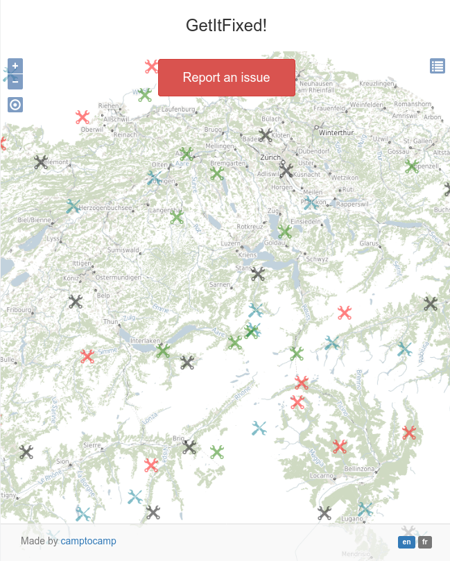
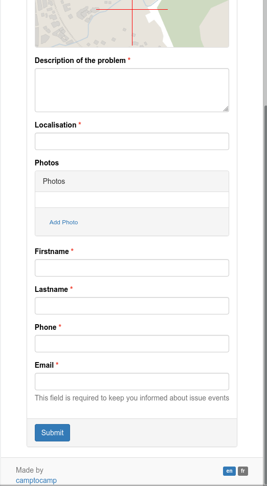
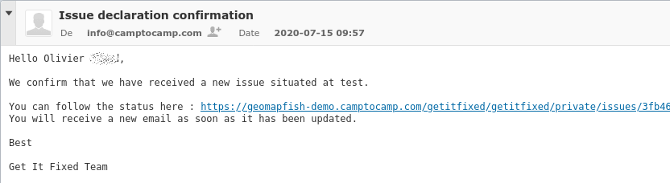
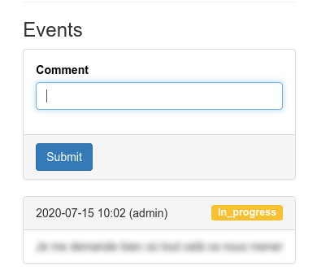
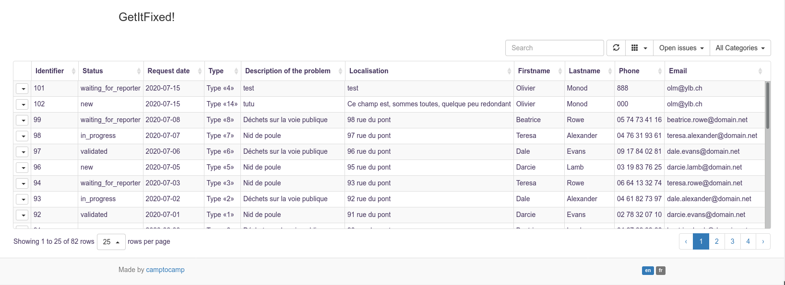

Here are some screenshots to discover our application! There are two parts:
frontend for user and backend for managers.

Managers are the team that will manage the ticket until it is closed.

# Frontend

## Public informations

The main part of the application is a simple map to localize tickets. Each are
shown with an icon related to its category. Icons are customizable by the
administrator of the application.

A click on the icon displays the description of the ticket: title, short
description, localization, catergory and type of ticket.

## Public form

When an user create a new ticket, an empty form ask for a more accurate
localization - the map zoom to the previous location in the map index - and to
choose a category and a type.

One possibility for admin is to setup a cusotm WMS layer to overlays the map
related to the category the user choose. For example, if the category is about
road network issue, he can display road signs localization.

Then user should fill in forms to add descriptions, contact information.

After submiting the form, the user will receveive a confirmation mail with
a link to a private form. This private form let's the user to communicate with
the management team, follow the evolution of the ticket.

Each time management team add an event to the ticket, the user will receive an
email.

In the other side, the management team receive an email to alert about the new
ticket.

All email description can be customizable with a template.

## Private forms

the first part of the form is similar as the public description page plus an
event section.

Event section is a way to have the history of the communication related with
the ticket:
* state change: New -> Validated -> In progress -> Waiting for Reporter ->
  Resolved
* communication between manager toward user
* communication between user toward manager

A simple form let the user communicate more informations.

# Backend

Backend index page is a simple table which list all not-closed tickets. Double
click display the ticket informations. Manager can add an event as explain
above:
* state change: New -> Validated -> In progress -> Waiting for Reporter ->
  Resolved
* add a communication between manager toward user
* see communication between user toward manager

Manager can also make the ticket private. This way, only manager and user can
see the ticket and its informations.

